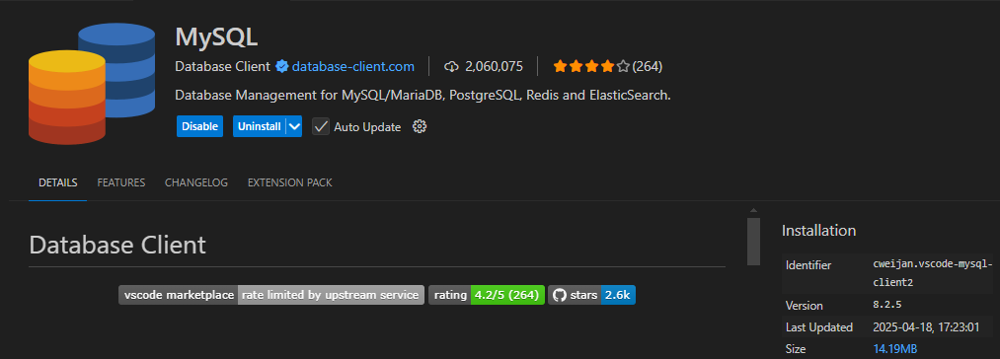
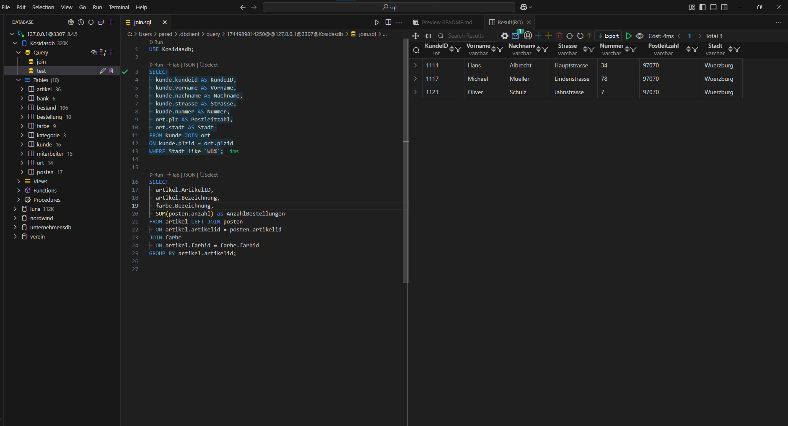

# MySQL Docker Setup with Auto-Init Databases

This project builds a custom MySQL Docker image that automatically initializes any database from the `database/` folder.

---

## Prerequisites

* Docker installed

---

## 1. Build the Docker Image

From the project root (where this `Dockerfile` lives), run:

```bash
docker build -t mysql-template .
```

This creates an image named `mysql-template` that includes your database scripts.

> [!TIP]
> Use the VS Code task:
>
> * Press `Ctrl+Shift+P` → `Tasks: Run Task`
> * Choose `Build Image`

---

## 2. Run the MySQL Container

Start a container with:

```bash
docker run -d \
  --env-file .env \
  --name mysql-template-db \
  -p 127.0.0.1:3307:3306 \
  -v mysql-data:/var/lib/mysql \
  mysql-template
```

> [!TIP]
> Use the VS Code task:
>
> * Press `Ctrl+Shift+P` → `Tasks: Run Task`
> * Choose `Build Image and Run`

* `-p 127.0.0.1:3307:3306` maps MySQL’s port 3306 inside the container to port 3307 on your host.
* `-v mysql-data:/var/lib/mysql` creates a named volume to persist database files between restarts.
* On first startup, MySQL will automatically execute all `.sql` files in `/docker-entrypoint-initdb.d` (our copied `database/` scripts), creating and populating the databases.

---

## 3. Verify Initialization

Once the container is running, connect and check:

```bash
set -a && source .env && set +a && docker exec -it mysql-template-db mysql -uroot -p$MYSQL_ROOT_PASSWORD
```

Inside the MySQL CLI, run:

```sql
SHOW DATABASES;
```

You should see your expected database(s).

To run any additional SQL script manually:

```bash
docker exec -i mysql-template-db mysql -uroot -p$MYSQL_ROOT_PASSWORD < path/to/script.sql
```

---

## 4. Connect from VS Code

Install the **MySQL** extension by **cweijan**.



Use these connection settings:

| Field    | Value                  |
| -------- | ---------------------- |
| Host     | `127.0.0.1`            |
| Port     | `3307`                 |
| Username | `root` or `admin`      |
| Password | from `.env`            |
| Database | *(any or leave blank)* |

Open a new query tab and run SQL—results will show up in a nice table view.

---

## Preview of a working state using the extension:



---

## 5. Cleanup / Reset

Use the VS Code task:

* `Clear all`

Or manually run:

```bash
docker stop mysql-template-db
docker rm mysql-template-db
docker volume rm mysql-data
```

---

## 6. VS Code Tasks

Defined in `.vscode/tasks.json`:

```json
{
  "version": "2.0.0",
  "tasks": [
    {
      "label": "Build Image",
      "icon": {
        "id": "inbox",
        "color": "terminal.ansiYellow"
      },
      "type": "shell",
      "command": "docker build -t mysql-template .",
      "problemMatcher": []
    },
    {
      "label": "Build Image and Run",
      "icon": {
        "id": "play",
        "color": "terminal.ansiWhite"
      },
      "type": "shell",
      "command": "docker build -t mysql-template . && docker run --env-file .env -d --name mysql-template-db -p 127.0.0.1:3307:3306 -v mysql-data:/var/lib/mysql mysql-template",
      "problemMatcher": [],
      "detail": "Builds the MySQL image with embedded SQL scripts and runs the container"
    },
    {
      "label": "Clear all",
      "icon": {
        "id": "trash",
        "color": "terminal.ansiWhite"
      },
      "type": "shell",
      "command": "docker stop mysql-template-db && docker rm mysql-template-db && docker volume rm mysql-data",
      "problemMatcher": []
    },
    {
      "label": "Recreate (with volume reset)",
      "icon": {
        "id": "sync",
        "color": "terminal.ansiCyan"
      },
      "type": "shell",
      "command": "docker stop mysql-template-db || true && docker rm mysql-template-db || true && docker volume rm mysql-data || true && docker build -t mysql-template . && docker run --env-file .env -d --name mysql-template-db -p 127.0.0.1:3307:3306 -v mysql-data:/var/lib/mysql mysql-template",
      "problemMatcher": []
    }
  ]
}
```

Launch with `Tasks: Run Task` from the Command Palette.

---

## Notes

* The `database/` folder is copied into the image and any `.sql` file inside is executed **once** during first-time initialization of the container volume.
* Grant permissions and `CREATE DATABASE` commands should be included in one of the `.sql` files, usually `create.sql`.
